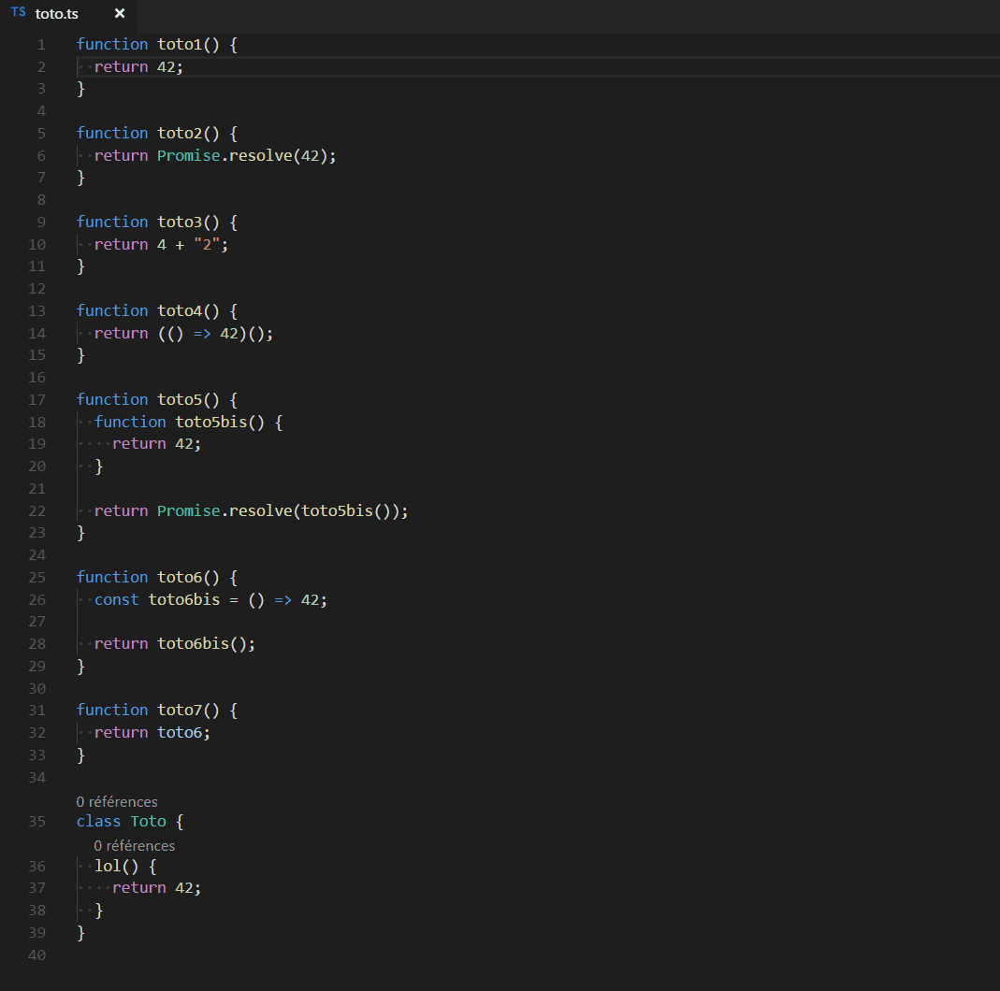
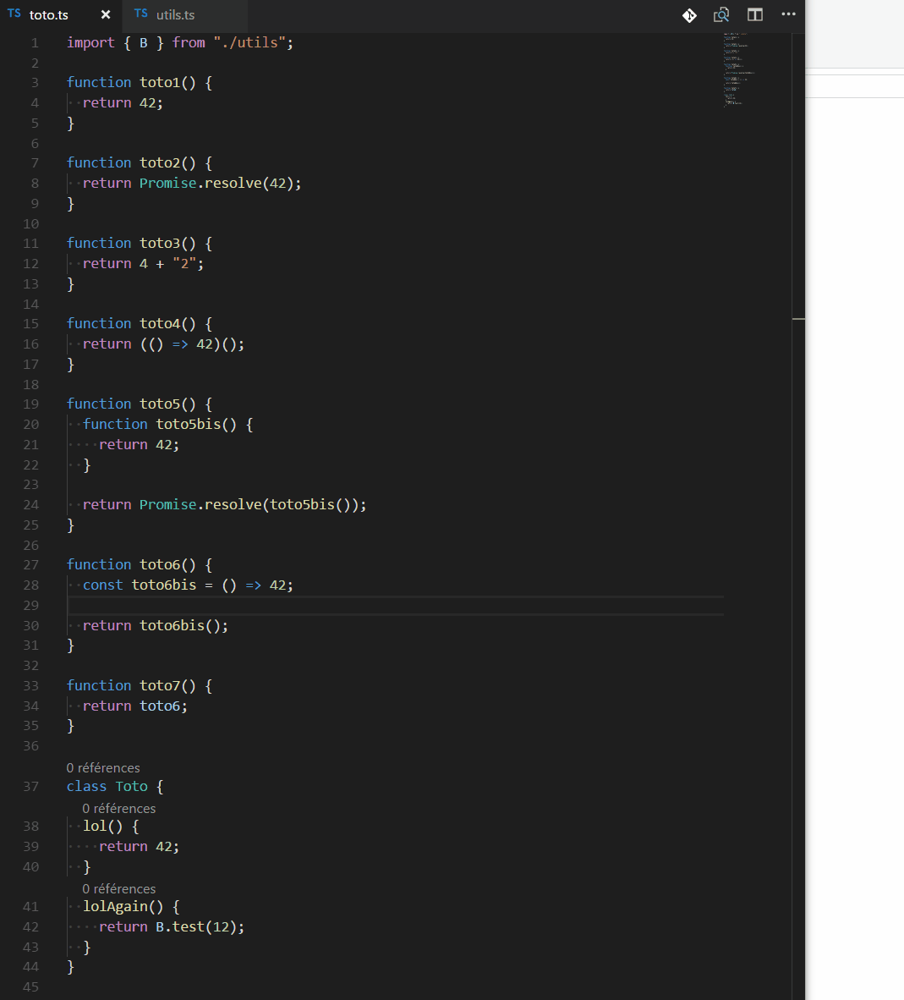
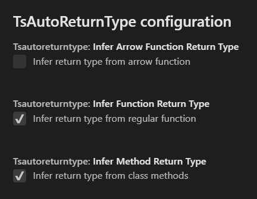

# TS-Auto-Return-Type

Stop writing the return type of your functions by yourself ! If TypeScript can infer a type, it will be printed for you !

## Features

At the moment, TS-Auto-Return-Type work only usings commands.

### Commands

- **TsAutoReturnType: Selected function**

- **TsAutoReturnType: File**

## Extension Settings

## Known Issues

Fill free to leave issues or pull request [on this repository](https://github.com/GuillaumeNury/vscode-ts-auto-return-type).

## Release Notes

### 0.0.1 - 2018-01-18

Initial release
